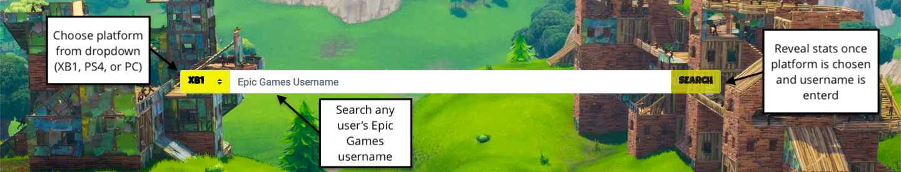
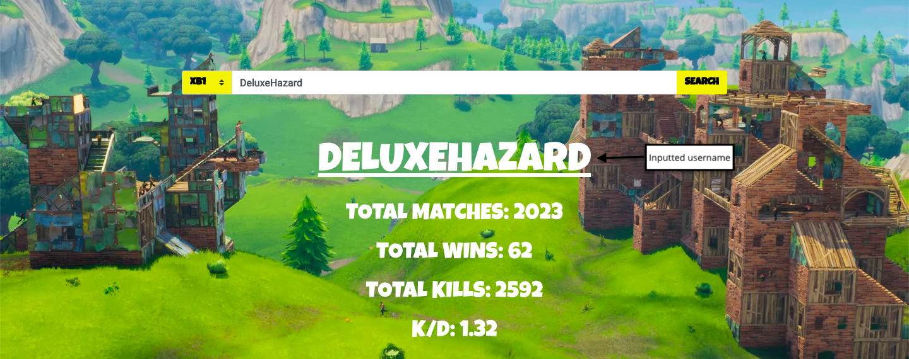
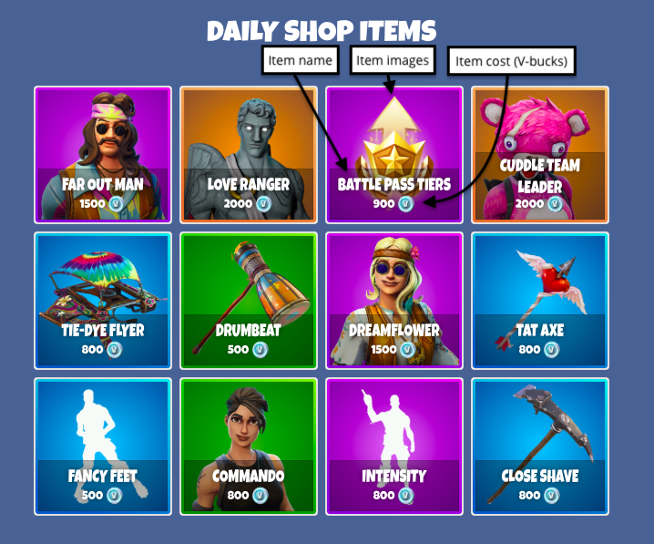
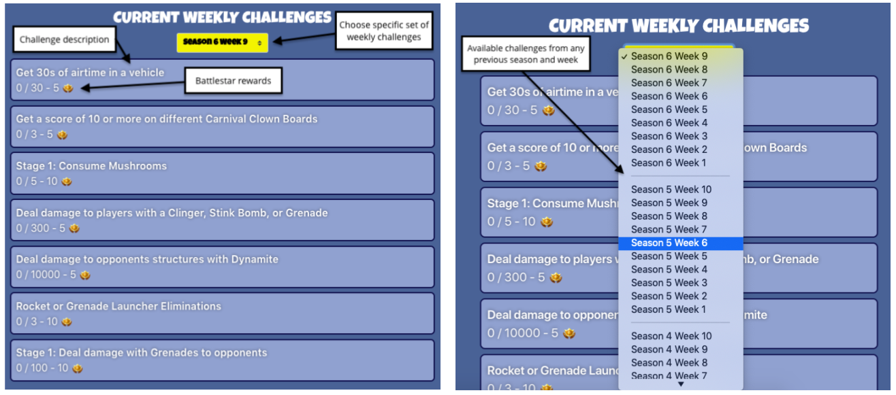
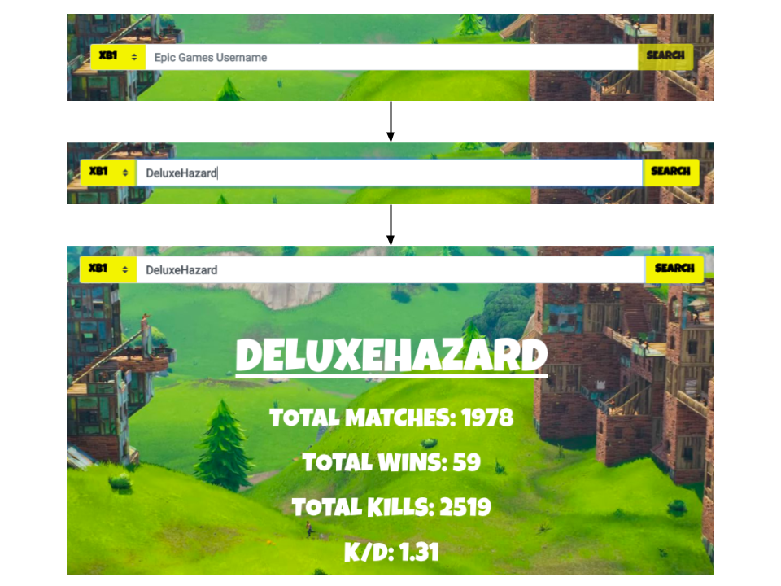
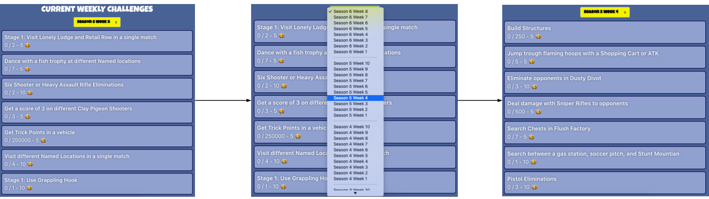

# Front-End Evaluation and Design Vision Document

## Introduction
This application is a Fortnite web application that shows users' Fortnite Battle Royale stats, the daily shop items, and the currently weekly challenges and allows users to view any past weekly challenges.
It uses HTML, JavaScript/jQuery, CSS, Bootstrap, and a [Fortnite API](https://fortniteapi.com/).
To view a player's stats, the user types in the specified player's Epic Games' username into the search field in the middle of the page and selects the desired platform from Xbox One (XB1), Playstation 4 (PS4), of PC (PC).
If the username-platform combination is valid, the web application displays the player's total matches, total wins, total kills, and kill to death ratio (K/D).
For the daily shop items, these load in automatically below the stats search bar.
For the weekly challenges, the current weekly challenges load in automatically below the stats search bar.
If a user wants to view any past weekly challenges, there is a dropdown below the displayed weekly challenges that allows for such.
The user can choose any past set of weekly challenges, and once the desired weekly challenges are selected the challenge section is populated with the chosen weekly challenges.

## Evaluation

### Heuristic Evaluation
In terms of mental models, I want to focus on the search section and challenge section since the daily item shop section has no interaction.

For the search section, it has three components: a platform dropdown, an input search bar, and a search button.
For the platform dropdown, the right side of it contains an upward pointing triangle above a downward pointing triangle.
For users who have used any computer before, dropdowns commonly have an upward pointing triangle/arrow above a downward pointing triangle/arrow.
This model follows in my front end and users testing this recognized it quickly.
For the search bar, it is simply a white rectangle with dimmed text instructing the user to "Search Epic Games Username".
On most websites, a search bar communicates to the user that it is a search bar, which mine does by directly telling the user to search for an Epic Games username.
Lastly, the search button itself says "search" on it. Additionally, when the user hovers over the search button with the mouse, it dims, thus telling the user that it is clickable.

For the challenges section, the only interactable component it contains is the challenge dropdown.
Similar to the dropdown in the search section, the right side of it contains an upward pointing triangle above a downward pointing triangle.
For users who have used any computer before, dropdowns commonly have an upward pointing triangle/arrow above a downward pointing triangle/arrow.
This model follows in my front end and users testing this recognized it quickly.

### Usability Metrics
1. **Learnability**

    I had users test out the various functions of my web application such as searching a user's stats, locating shop items, and viewing and changing challenges.
    Each user was timed from the start until he/she completed the final task.
    The tasks for each user were:

    1. Locate the search bar, search for the stats of “Ninja" on the PC platform, and record his K/D (at the time of testing).
        1. 11.19 or 11.2
    2. Locate the search bar, search for “Donovan is the best" on the PS4 platform, and record what.
        1. Displays error: "Could not find this user. Please make sure you entered the correct Epic Games username and chose the correct platform."
    3. Locate the challenges section, change the challenges to display Season 4 Week 3, and record two of the challenges and their respective stars reward.
        * Revive players - 5
        * Deal damage with Pistols to opponents - 5
        * Search Chests in Lonely Lodge - 5
        * Search Rubber Duckies - 5
        * Follow the treasure map found in Salty Springs - 10
        * Sniper Rifle Eliminations - 10
        * Eliminate opponents in Tilted Towers - 10
    4. Locate the daily items shop and record the name and respective costs of two of the available items (at time of testing).
        * Far Out Man - 1500
        * Love Ranger - 2000
        * Battle Pass Tiers - 900
        * Cuddle Team Leader - 2000
        * Tie-Dye Flyer - 800
        * Drumbeat - 500
        * Dreamflower - 1500
        * Tat Axe - 800
        * Fancy Feet - 500
        * Commando - 800
        * Intensity - 800
        * Close Shave - 800
    
    *Notes and observations*:
    * Out of 8 users, the average time for completing all the tasks was 2 minutes and 24.5 seconds, with the shortest being 1 minute and 37 seconds and the longest being 3 minutes and 31 seconds.
    * When users did the first task of search for the stats of "Ninja", a common mistake was users clicking search right away without switching the platform to PC.
        I did this intentionally so users would not automatically click search without specifying the platform. 
        Once people discovered the platform dropdown, they searched the stats with ease.
        Additionally, now that users knew about the platform dropdown, they immediately switched the platform to PS4 before searching the given username.

2. **Satisfaction**

    After completing the given tasks, I had users rate four components of the web application on a scale of 1 to 10.
    The graded components included:

    1. Visual appeal
    2. Searching for users
    3. Navigating between sections (search, shop items, challenges)
    4. Switching between challenges

    *Results and Feedback*
    1. Visual appeal
        1. Average score: 9.5/10
        2. Most people very much liked the front end design since it is styled after the Fortnite theme.
            One suggestion though was to have the challenge tiles' color changed to something that contrasts more against the background.
    2. Searching for users
        1. Average score: 9.625/10
        2. All users agreed that searching for users is very clean and simple.
    3. Navigating between sections (search, shop items, challenges)
        1. Average score: 9.75/10
        2. For the most part, users liked that everything is on a single page.
            Some users though suggested adding tabs to switch between sections rather than having everything displayed at once.
    4. Switching between challenges
        1. Average score: 9.125/10
        2. Navigating between challenges was easy to learn and to navigate.
            Some users though felt overwhelmed by the number of weeks to choose from the dropdown (there are currently 39 weeks to choose from).
            These users suggested having two separate dropdowns: one for choosing the season and another for choosing the week.

    *Alignment with original usability metric forecast*
    
    * I originally predicted that my web application would excel in the visual appeal and learnability.
        I predicted both fairly well as both aspects received positive feedback.
    * Now that I have experienced the full cycle of designing then implementing then evaluating a front end, I have learned that there is always subjective factors that I cannot account for.
        For example, the overwhelming aspect of the challenge dropdown is something I would have never thought of since I like the single dropdown with all the weeks in one section.
        Some users wanted this information sectioned off by season and week, making the information less overwhelming for certain users.

### Recap
Overall, my front end's usability is good.
A majority of the feedback given on my front end is positive, with a few subjective suggestions from testing users.
For the search section, I may change the order of the platforms from XB1 -> PS4 -> PC to PC -> XB1 -> PS4 since PC is the most popular platform for Fortnite.
For the daily items shop section, its only role is to display the current shop items, so it does its function as intended.
For the challenges section, some users did give feedback on the overwhelming amount of information in a single dropdown.
Moving forward, I will take this into consideration when updating this section. 
For all sections, some users did suggest using tabs to display each section individually rather than everything at once.
I do not plan on altering that for the desktop version, but for the mobile version, I will take such feedback into consideration since mobile screens are much smaller than desktop screens.
All in all, I would say my front end is very usable.

## Design Vision

### Top-Level Design/Layout

My front end consists of three sections: a stats section, daily item shop section, and weekly challenges section.

***Stats Section***

The stats section consist of three interactable components: a platform selection dropdown, a search bar, and a search button.
The platform selection dropdown allows users to specify the desired platform he/she is searching for in relation to the supplied username.
For the search bar, users input any Fortnite player's Epic Games username.
Once the platform and username are specified, users will click the search button and the all-time stats of the searched user will be displayed.
These stats include total matches, total wins, total kills, and kill to death ration (K/D).

***Daily Item Shop Section***

The daily item shop section automatically displays the current items in the Fortnite item shop.
There are no interactable components within this section, but each item displays the item's image, name, and cost.

***Challenges Section***

The challenges section displays the current set of weekly challenges by default, with the dropdown indicating what the current season and week are as well.
To choose a different set of weekly challenges to view, users must click on the dropdown above the challenges and choose from any of the given seasons and weeks.
Upon choosing a different set, the challenges will update to display the challenges of the chosen week.

### Usage Scenarios

#### Searching for a player’s Fortnite Battle Royale stats
The user must click on the search bar in the middle of the screen and types in the desired player’s Epic Game username.
The user must also click the dropdown menu next to the username input field to choose the specified platform (PC, Xbox One, PS4) of the player.
After a username has been entered and a platform is chosen, the user clicks on the search arrow at the far right of the search bar to request the stats of the searched player.
If the username or username/platform combination is not found, an error will be brought up addressing the error.
Upon retrieval of the stats, below the search bar, a section will appear which shows the stats of the player including total wins, win percentage, kills, and K/D.

#### View weekly challenges
The user must locate the challenge section of the web application, which for desktop is in the bottom right and on mobile is at the bottom.
Once located, the user will view the current weekly challenges by default.
If the user wishes to view the challenges of any past season and week, the user can do so using the dropdown menu above the challenges.
The dropdown menu will have a list of combinations of every preview season and week.
The user may select any of these options, and once chosen the challenges of that week will replace the previously shown challenges with the desired ones.

### Design Rationale
Something I greatly strived for while designing my front end was for it to be visually consistent with the Fortnite them.
Shneiderman’s first rule in his "Eight Golden Rules of Interface Design" is to strive for consistency.1
Consistency has multiple types, but the one I focused on the most was visual consistency.
Fortnite has a theme for a younger audience with vibrant colors, bold and wacky fonts, and large buttons, and I wanted that consistency for users coming for Fortnite to my application.
For example, my buttons and dropdowns are all bright yellow with the Fortnite font to display text on them, just like in the actual game.
This allows for increased learnability because users coming from Fortnite will already know what components of my application are interactable buttons/dropdowns since they are the same in Fortnite.2

Secondly, I wanted users to feel that they are in control of the application, meaning I wanted to support the internal locus of control.1
A good example of this is my challenges section.
I initially had my application only show the current weekly challenges, but then I implemented an option for users to choose which weekly challenges they wanted to view.
This gives users a feeling of being in control of the application, thus supporting internal locus of control.
One issue with the dropdown though is that it is very long, which should generally be avoided.3
This makes it impossible for users to see all the available choices at once.3
A solution for this would be using a mega menu and utilize the open horizontal space, thus showing all the available options at once for the user.4

Lastly, the search bar section minimizes input actions by the user.
The search section contains three components: a platform select dropdown, a search bar for users to input Epic Games usernames, and a search button.
For the platform select dropdown, this was chosen over manually entering in the desired platform because choosing between three options is more preferable than manually entering the platform.5
For the search bar, its only function is to retrieve the stats of the inputted username.
The search bar also contains a placeholder value which instructs users to "Search Epic Games Username" and is wide enough to view any valid Epic Games username.5

### Usability Metric Motivation
While designing my front end, the priority metrics I focused on the most were learnability, efficiency, and satisfaction while I was not as concerned with memorability and errors.

The greatest priority was given to satisfaction.
I intended for my application's theme to be consistent with the Fortnite theme so that my application would feel like an extension of Fortnite.
I believe I achieved that because users testing my application recognized the Fortnite theme really appreciated it.

Next, I focused greatly on learnability.
I designed my application to be clean and straightforward for all users.
There are only four components the user can interact with, those being the platform select dropdown, the search bar, the search button, and the weekly challenges dropdown.
Keeping my front end in terms of interactable components makes it less confusing for users and easy for users to learn what these few components do.

With my application being easy to learn, I also focused on my application's efficiency.
Once a user has mastered the components of my application, which should only take a few minutes max, it should be easy for users to seamlessly use my application since there are only a few simple things needed to be learned.

Since my application is very easy to learn, I did not focus on memorability.
My application uses components that are common to most of the internet (dropdowns, search bar, search button).
This means that my users would not have to focus on memorability for my front end since navigation of the internet itself will be enough prior information to utilize my application effectively.

Lastly, since there is minimal interaction within my application, errors are not of much concern for me.
If any errors do occur, simply refreshing the page should suffice.
Additionally, users are able to submit issues to the application's Github repository.

## References
1: https://faculty.washington.edu/jtenenbg/courses/360/f04/sessions/schneidermanGoldenRules.html

2: https://uxdesign.cc/design-principle-consistency-6b0cf7e7339f

3: https://www.nngroup.com/articles/drop-down-menus/

4: https://www.nngroup.com/articles/mega-menus-work-well/

5: https://www.userfocus.co.uk/resources/formschecklist.html